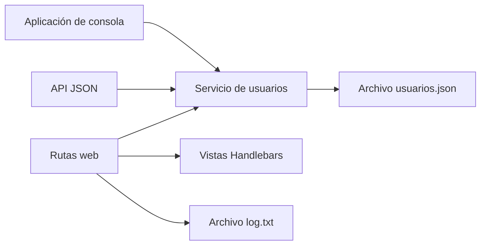

```mermaid
flowchart LR
A[Aplicación de consola] --> D[Servicio de usuarios]
B[Rutas web] --> D
C[API JSON] --> D
D --> E[Archivo usuarios.json]
B --> F[Vistas Handlebars]
B --> G[Archivo log.txt]
```
